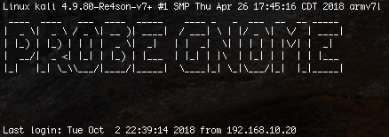

This is a modifcation of NickHarris0/probemon which captures proberequests, compares it against a database or CSV 
then reads the "would be intruders" mac address back to them. 

The other day I had a package stolen off of my front porch, and I thought, "Hey, why dont I just scan for probe requests and then read it back to the theif"?
So, I used probemon on a raspi running kali linux with an Alpha wireless card. I then modified probemon to trigger when it reads a new proberequest that is 
not on a "whitelist" of OK MAC addresses. If a new MAC / Device is foung, it then reads it out over a speaker using espeak.
I then put it onto a gnome and Called it probeGnome. 

It's best to get a gnome that really conveys how you feel about amazon package thieves.

[](http://www.youtube.com/watch?v=UP-qNT3czHg "probeGnome")

Notes:
probemon uses python2.7

Dependencies:

netaddr
scapy
espeak

or pip install requirements.txt


You'll need to do some reading to figure out how to set up kali on a raspi.

https://null-byte.wonderhowto.com/how-to/set-up-headless-raspberry-pi-hacking-platform-running-kali-linux-0176182/

https://null-byte.wonderhowto.com/how-to/log-wi-fi-probe-requests-from-smartphones-laptops-with-probemon-0176303/

Finally, this guy is really the dude behind it all. 

https://nikharris.com/tracking-people/

get some speakers and make sure that espeak is working. You could also use this to turn on a camera and start logging, really, this acts as a trigger for an action. 

From there

To use, make sure that you have attached you alpha wireless card via USB. and set it in monitor mode

`airmon-ng start wlan0`

or whatever your alpha wireless card is listed as <wlan0>. 

From there, navigate to the probemon directory and go:

`python probemon.py -i wlan0mon -t unix -o ~/Loggin -f -s -r`

if you want, you can add a cool text image if you think that makes it look cooler. I kinda do think that.



# probemon
A simple command line tool for monitoring and logging 802.11 probe frames

I decided to build this simple python script using scapy so that I could record 802.11 probe frames over a long period of time. This was specifically useful in my use case: proving that a person or device was present at a given location at a given time.

## Usage

```
usage: probemon.py [-h] [-i INTERFACE] [-t TIME] [-o OUTPUT] [-b MAX_BYTES]
                   [-c MAX_BACKUPS] [-d DELIMITER] [-f] [-s]

a command line tool for logging 802.11 probe request frames

optional arguments:
  -h, --help            show this help message and exit
  -i INTERFACE, --interface INTERFACE
                        capture interface
  -t TIME, --time TIME  output time format (unix, iso)
  -o OUTPUT, --output OUTPUT
                        logging output location
  -b MAX_BYTES, --max-bytes MAX_BYTES
                        maximum log size in bytes before rotating
  -c MAX_BACKUPS, --max-backups MAX_BACKUPS
                        maximum number of log files to keep
  -d DELIMITER, --delimiter DELIMITER
                        output field delimiter
  -f, --mac-info        include MAC address manufacturer
  -s, --ssid            include probe SSID in output
  -l, --log             enable live scrolling view of the logfile
```

